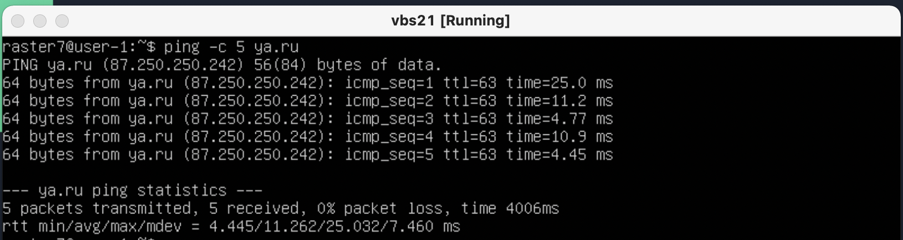
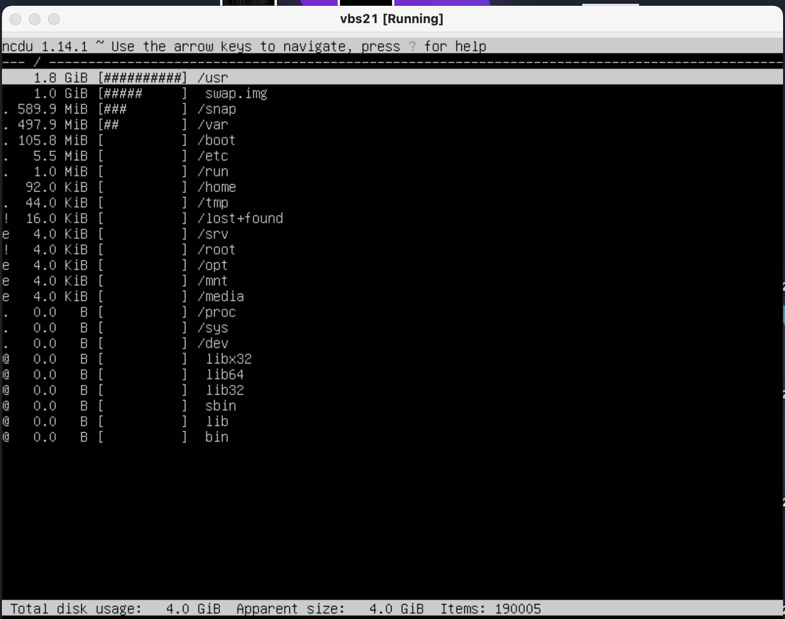

# UNIX/Linux operating systems (Basic)

Linux system installation and updates. Administration basics.

## Part 1. Installation of the OS

##### Install Ubuntu 20.04 Server LTS

cat /etc/issue

## Part 2. Creating a user

##### Create a user other than the one created during installation. The user must be added to adm group.

Creating a new user

cat /etc/passwd

## Part 3. Setting up OS network

##### Set the machine name as user-1

##### Set the time zone corresponding to your current location.

##### Output the names of the network interfaces using a console command.

##### In the report give an explanation for the presence of the lo interface.

Interface lo can be used by network client software to communicate with a server application located on the same computer. That is, if you specify the URL http://127.0.0.1/ or http://localhost/ in the web browser on the computer where the web server is running, it takes you to that computer's web site. This mechanism works without any active connection, so it is useful for testing services without compromising their security as with remote network access.

##### Use the console command to get the ip address of the device you are working on from the DHCP server.

Decode DHCP in the report.

Dynamic Host Configuration Protocol (DHCP) is a network management protocol used to automate the process of configuring devices on IP networks, thus allowing them to use network services such as DNS, NTP, and any communication protocol based on UDP or TCP. 

##### Define and display the external ip address of the gateway (ip) and the internal IP address of the gateway, aka default ip address (gw)

external IP address
A internal IP address is a range of non-internet facing IP addresses used in an internal network. Internal IP addresses are provided by network devices, such as routers, using network address translation.

internal IP address
A internal IP address is a range of non-internet facing IP addresses used in an internal network. Internal IP addresses are provided by network devices, such as routers, using network address translation.

##### Set static (manually set, not received from DHCP server) ip, gw, dns settings (use public DNS servers, e.g. 1.1.1.1 or 8.8.8.8).

sudo vim /etc/netplan/00-installer-config.yaml

make some changes

after all need to write "sudo netplan apply" to console, then reboot.

##### Reboot the virtual machine. Make sure that the static network settings (ip, gw, dns) correspond to those set in the previous point.

"ping -c 5 ya.ru" to ping 5 times and see the result. Same with 1.1.1.1

"ip r" to console, to check that our settings was saved.

## Part4. OS Update

##### Update the system packages to the latest version

"sudo apt update" to download updates.

"sudo apt upgrade" to install updates.

upgrade in progress

"sudo apt update" again, to check that all packages are up to date.

## Part 5. Using the sudo command

sudo allows a permitted user to execute a command as the superuser or another user, as specified by the security policy. The invoking user's real (not effective) user-ID is used to determine the user name with which to query the security policy.

"sudo usermod -a -G sudo dashilow" to add our user from part-2(dashilow) to sudo group

"su dashilow" to login as dashilow.

"sudo hostnamectl set-hostname user-1"

## Part 6. Installing and configuring the time service

"sudo timedatectl set-ntp on" to enable auto-synchronization

## Part 7. Installing and using text editors

##### Install VIM text editor (+ any two others if you like NANO, MCEDIT, JOE etc.)

##### Using each of the three selected editors, create a test_X.txt file, where X is the name of the editor in which the file is created. Write your nickname in it, close the file and save the changes.

:wq to exit with save.

CTRL+s to save, CTRL+x to exit.

CTRL+k+x to exit with save.

result

##### Using each of the three selected editors, open the file for editing, edit the file by replacing the nickname with the "21 School 21" string, close the file without saving the changes.

:q! to exit without save

CTRL+x then n to exit w/o save.

CTRL+c then y to exit w/o save.

result

##### Using each of the three selected editors, edit the file again (similar to the previous point) and then master the functions of searching through the contents of a file (a word) and replacing a word with any other one.

VIM:

Before prossing enter:

:s/foo/bar

foo - serching word

bar - replacement word

NANO:

after pressing enter

ctrl+\ to search text u need, then press enter, then enter what you want to paste, then press enter 1 more time, then press y to apply the changes.

JOE:

CTRL+kf to start search, then R to replace, then enter and type new string.

## Part 8. Installing and basic setup of the SSHD service

##### Install the SSHd service.

sudo apt install openssh-server

sudo systemctl enable ssh - to enable ssh on boot

##### Add an auto-start of the service whenever the system boots.

systemctl list-unit-files --type=service --state=enabled

##### Reset the SSHd service to port 2022.

sudo vim /etc/ssh/sshd_config

servise ssh restart

netstat -tan

## Part9. Installing and using the top, htop utilities

##### Install and run the top and htop utilities.

top

"top - 16:26:52 up 2 min" - uptime
"1 user" - number of authorised users
"load average: 0.00, 0.00, 0.00" - total system load
"Tasks: 102 total" - total number of process
"%Cpu(s): 0.0 us, 0.0 sy, 0.0 nim100.o id" - cpu load
"MiB mem: 1983.4 total, 1516.0 free" - memory load
"2" - pid of the process with the highest memory usage
"160" - pid of the process taking the most CPU time

htop

PID

PERCENT CPU

PERCENT MEM

TIME

Syslog

## Part 10. Using the fdisk utility

sudo fdisk -l

swapon --show

## Part 11. Using the df utility

df

1-K blocks = 1024 bytes.

Size: 9979Mb
Used: 4418Mb
Available: 5032Mb
Use: 47%

df -TH

Size: 9.8Gb
Used: 4.4Gb
Available: 5.0Gb
Use: 47%

## Part 12. Using the du utility

##### Run the du command.

##### Output the size of the /home, /var, /var/log folders (in bytes, in human readable format).

bytes

Human-readable

##### Output the size of all contents in /var/log (not the total, but each nested element using *)

## Part 13. Installing and using the ncdu utility

##### Install the ncdu utility.

sudo apt install ncdu

ncdu

##### Output the size of the /home, /var, /var/log folders.

## Part 14. Working with system logs

vim /var/log/desg

vim /var/log/syslog

vim /var/log/auth.log

Sep 14 17:00:08, raster7, systemd-logind.

## Part 15. Using the CRON job scheduler

##### Using the job scheduler, run the uptime command in every 2 minutes.

crontab -e

vim /var/log/syslog

##### Remove all tasks from the job scheduler.
